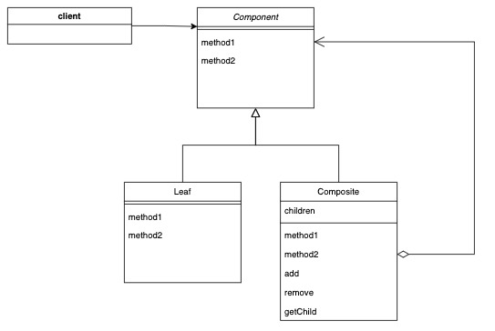

# Composite
## 概要
容器と中身を同一して、再帰的な構造を作る実装パターン。
ファイルシステムのディレクトリのようなイメージ。ディレクトリの中にファイルとディレクトリ(フォルダ)が存在し、そのディレクトリの内部にもファイルとディレクトリが存在している。このような入れ子になった構造を実装する。
## クラス間の関係

## 実装の詳細
* [TypeScript](https://github.com/sakana7392/Design_Patterns/tree/main/Composite/TypeScript)
| クラス名         | 役割 |
| ---------------- | ---- |
| Entry(Component) |    FileとDirectoryを同一視する抽象クラス  |
|      Directory(Composite) | 容器のとして機能するDirectoryクラス     |
| File(leaf)       | 下部要素を持たないFileクラス|
## 実装するメリットとデメリット
### メリット
* 再起的な構造を実装することで、複雑な木構造を簡潔に記述できる。
* 既存のコードを壊さずに新規の要素を木構造に追加できる
### デメリット
* 要素の機能が大きく異なる場合、共通のインターフェイスを定義することが難しい。
## 実装したコード
<!-- * [c++](https://github.com/sakana7392/Design_Patterns/tree/main/Composite/c++) -->
* [TypeScript](https://github.com/sakana7392/Design_Patterns/tree/main/Composite/TypeScript)
<!-- * [Go](https://github.com/sakana7392/Design_Patterns/tree/main/Composite/Go) -->
